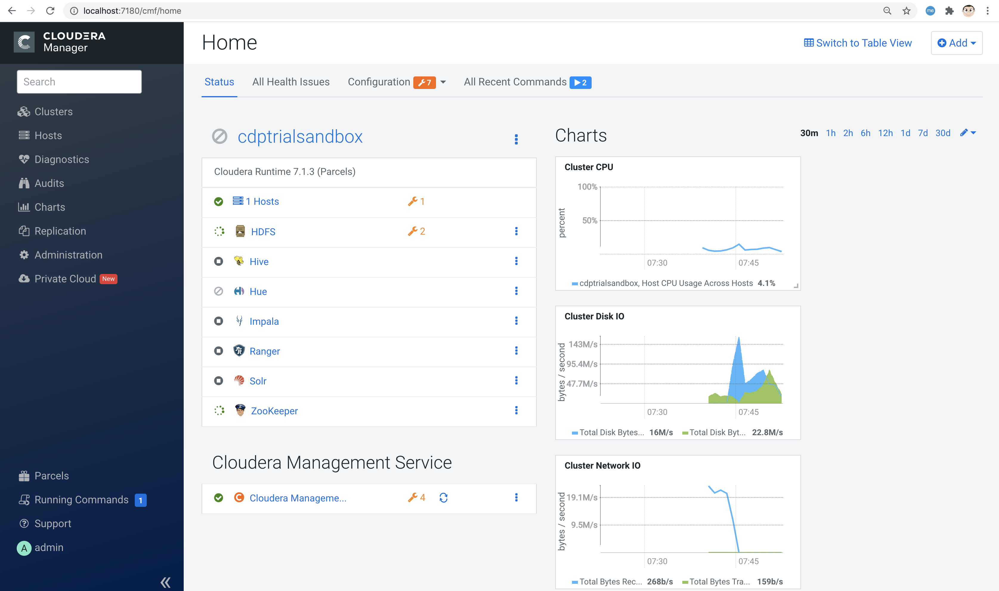
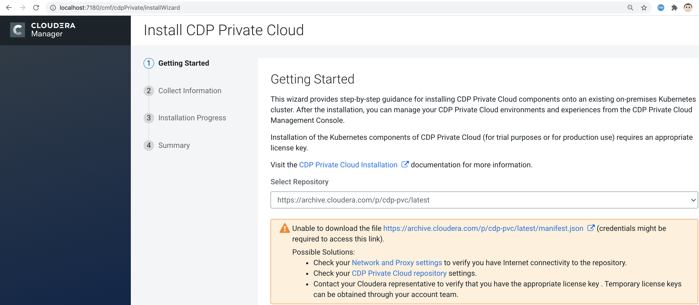
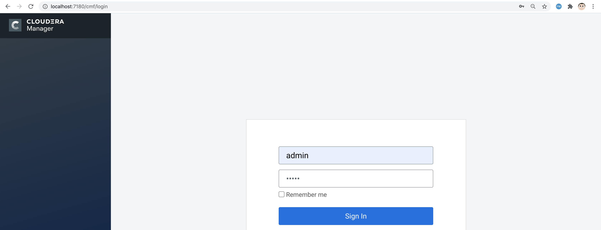
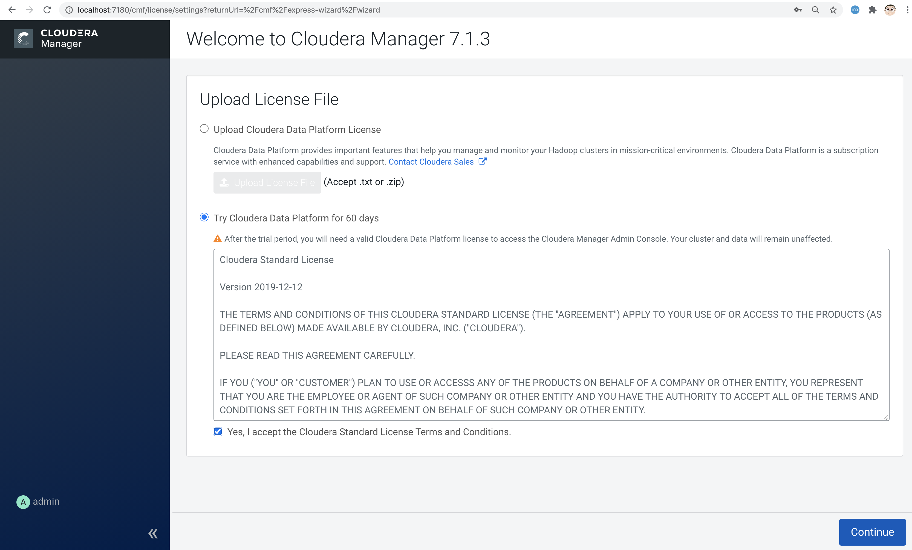
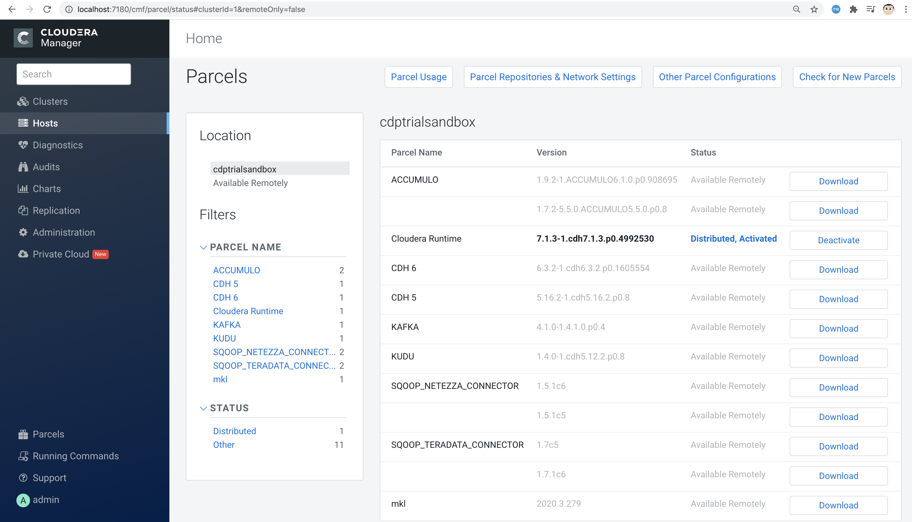
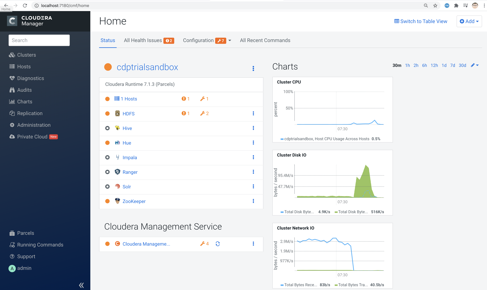

== 1. Build and run a Cloudera CDP Private Cloud Base (formerly known as CDP Data Center) trial environment in a dockerless container

== 2. Automate the install of OpenShift 4.5+ with YuniKorn scheduler for BigData and ML on your laptop, virtual machine or baremetal server using CodeReady Containers

Based on https://github.com/carrossoni/CDPDCTrial/

----
We'll use 
buildah to create the Cloudera CDP Private Cloud Base 
(formerly known as CDP Data Center)
trial environment container 

and

podman to run the Cloudera CDP Private Cloud Base container
----

See https://www.cloudera.com/products/cloudera-data-platform/cdp-private-cloud.html

----
The trial environment also includes a  wizard that provides 
step-by-step guidance for installing CDP Private Cloud components onto an existing on-premises Kubernetes cluster. 

After the installation, you can manage your 
CDP Private Cloud environments and experiences 
from the CDP Private Cloud Management Console.
----

NOTE: You can automate the install of OpenShift 4.5+ with YuniKorn scheduler for BigData and ML 
on your laptop, virtual machine or baremetal server using CodeReady Containers

See https://issues.apache.org/jira/browse/YUNIKORN-422 and 
https://github.com/marcredhat/crcdemos/blob/master/yunikorn/README.adoc

----
YuniKorn brings a unified, cross-platform scheduling experience for mixed workloads 
consisting of stateless batch workloads and stateful services, 
with support for, but not limited to, YARN and Kubernetes.
----

----
Buildah is a command-line tool for building Open Container Initiative-compatible 
(that means Docker- and Kubernetes-compatible, too) images quickly and easily. 
Buildah is easy to incorporate into scripts and build pipelines and 
doesn’t require a running container daemon to build its image.
See more at https://opensource.com/article/18/6/getting-started-buildah
----

The buildah script to create the container is at https://github.com/marcredhat/cloudera/blob/master/build.sh

----
curl -L https://raw.githubusercontent.com/marcredhat/cloudera/master/build.sh -o build.sh
chmod +x ./build.sh
./build.sh
----

----
Ignore errors displayed by the build.sh script; they are expected as we have not yet configured databases and services 
----

----
Let's have a look at the container created by the script above

sudo buildah containers
CONTAINER ID  BUILDER  IMAGE ID     IMAGE NAME                       CONTAINER NAME
82ebfa94f1ea     *     f142359e2130 registry.centos.org/centos/ce... centos-working-container
----

----
Commit the container to a new image

sudo buildah commit centos-working-container marccdp
----

----
Publish the container to your favorite registry

sudo podman  login -u="<quay.io user>" -p="<quay.io encrypted password>" quay.io
sudo podman push localhost/marccdp  quay.io/marcf5/marccdp
----

----
Starting services within the container using systemd
(from https://access.redhat.com/documentation/en-us/red_hat_enterprise_linux/8/html/building_running_and_managing_containers/using-systemd-with-containers_building-running-and-managing-containers)

Applications created to be managed with systemd can be started and managed inside a container. 
A container running systemd will:

Start the /sbin/init process (the systemd service) to run as PID 1 within the container.
Start all systemd services that are installed and enabled within the container, in order of dependencies.
Allow systemd to restart services or kill zombie processes for services started within the container.
The general steps for building a container that is ready to be used as a systemd services is:

Install the package containing the systemd-enabled service inside the container.

Use the systemctl command to enable the service inside the container.

Expose any ports needed to access the service.
----

----
sudo podman run  -p 7180:7180 --systemd=true --privileged  -it --name marccdp localhost/marccdp:latest /sbin/init
----

----
We can now connect to the Cloudera trial environment container and
configure databases, enable service etc
as shown at https://github.com/marcredhat/CDPDCTrial/blob/master/centosvmCDP.sh

In a new terminal window,
sudo podman exec -it marccdp /bin/bash

Check that DNS resolution works inside the container

[root@036bfc743a56 data]# hostname cloudera

In /etc/hosts, map the IP address of the CDP container to the "cloudera" hostname as follows:
<IP address of the CDP container>       cloudera

In /etc/cloudera-scm-agent/config.ini, replace the value for listening_ip with the IP address of the CDP container:
listening_ip=<IP address of the CDP container>
In /etc/cloudera-scm-agent/config.ini, replace the value for server_host with cloudera:
server_host=cloudera

[root@036bfc743a56 data]# service cloudera-scm-agent restart

[root@036bfc743a56 data]#systemctl start cloudera-scm-server

[root@036bfc743a56 data]#systemctl daemon-reload

[root@036bfc743a56 data]#systemctl start rngd

[root@036bfc743a56 data]#systemctl enable rngd

[root@036bfc743a56 data]# mysql -u root < /CDPDCTrial/scripts/create_db.sql

[root@036bfc743a56 data]# mysql -u root < /CDPDCTrial/scripts/secure_mariadb.sql

Check the logs
[root@036bfc743a56 data]# tail -f /var/log/cloudera-scm-server/cloudera-scm-server.log

[root@036bfc743a56 data]# /opt/cloudera/cm/schema/scm_prepare_database.sh mysql scm scm cloudera
JAVA_HOME=/usr/lib/jvm/java-1.8.0-openjdk-1.8.0.262.b10-0.el7_8.x86_64
Verifying that we can write to /etc/cloudera-scm-server
Creating SCM configuration file in /etc/cloudera-scm-server
Executing:  /usr/lib/jvm/java-1.8.0-openjdk-1.8.0.262.b10-0.el7_8.x86_64/bin/java -cp /usr/share/java/mysql-connector-java.jar:/usr/share/java/oracle-connector-java.jar:/usr/share/java/postgresql-connector-java.jar:/opt/cloudera/cm/schema/../lib/* com.cloudera.enterprise.dbutil.DbCommandExecutor /etc/cloudera-scm-server/db.properties com.cloudera.cmf.db.
[                          main] DbCommandExecutor              INFO  Successfully connected to database.
All done, your SCM database is configured correctly!

Create the folder /var/lib/postgres/data

[root@6de36c33185f /]# chown -R postgres /var/lib/postgres/data
[root@6de36c33185f /]# su - postgres -c "/usr/pgsql-9.6/bin/initdb --locale en_US.UTF-8 -D '/var/lib/postgres/data'"
[root@6de36c33185f /]# su - postgres -c "/usr/pgsql-9.6/bin/pg_ctl -D /var/lib/postgres/data -l logfile start"

[root@6de36c33185f /]# sudo -u postgres psql <<EOF 
CREATE DATABASE ranger;
CREATE USER ranger WITH PASSWORD 'cloudera';
GRANT ALL PRIVILEGES ON DATABASE ranger TO ranger;
CREATE DATABASE das;
CREATE USER das WITH PASSWORD 'cloudera';
GRANT ALL PRIVILEGES ON DATABASE das TO das;
EOF

[root@6de36c33185f /]# find / -name create_cluster.py
/CDPDCTrial/scripts/create_cluster.py

In /CDPDCTrial/scripts/create_cluster.py, replace 10.0.2.15 with the IP address of your Cloudera container

[root@6de36c33185f /]# python /CDPDCTrial/scripts/create_cluster.py /CDPDCTrial/conf/cdpsandbox.json
----

----
[root@6de36c33185f /]# ss -anpt | grep java | grep LISTEN
LISTEN     0      50           *:7180                     *:*                   users:(("java",pid=14718,fd=400))
LISTEN     0      50           *:7182                     *:*                   users:(("java",pid=14718,fd=392))
----

----
[root@6de36c33185f /]# systemctl status cloudera-scm-agent
[root@6de36c33185f /]# systemctl status cloudera-scm-server 
----

----
[root@6de36c33185f /]# curl -u "admin:admin"  http://127.0.0.1:7180/api/version
v41
----

----
[root@6de36c33185f /]# tail -f /var/log/cloudera-scm-server/cloudera-scm-server.log
----

----
If you are installing CDP on a baremetal server and you SSH into it from your laptop,
you can use port forwarding as follows:

ssh root@<baremetal server> -L 7180:localhost:7180
----

On your laptop, browse to http://localhost:7180 and connect as admin/admin

Click on "Continue" then on "Cloudera Manager" (top left corner)

The parcel download and distribution takes a long time, click on "Parcels" to monitor progress

And voilà

== Create an image of your CDP container

----
podman container stop marccdp

Choose a tmpdir where you have sufficient disk space
podman container commit -p marccdp marccdpconfigured --tmpdir=/home

podman save -o marccdpconfigured.tar marccdpconfigured
----

----
To create an image from the backup file that was made above, you do it with the command podman load -i backup_filename.

podman load -i marccdpconfigured.tar
----

See more on backup and restore with podman at https://fedoramagazine.org/backup-and-restore-toolboxes-with-podman/
